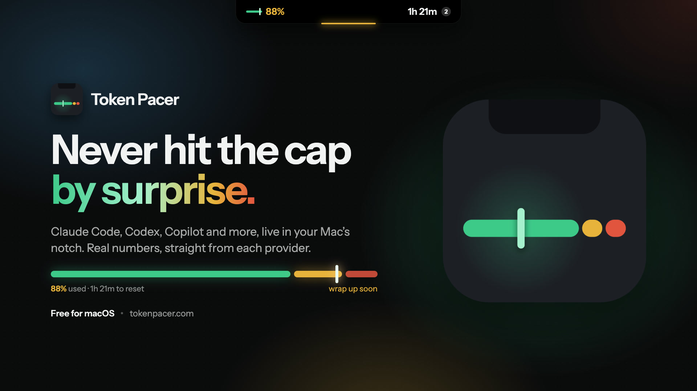
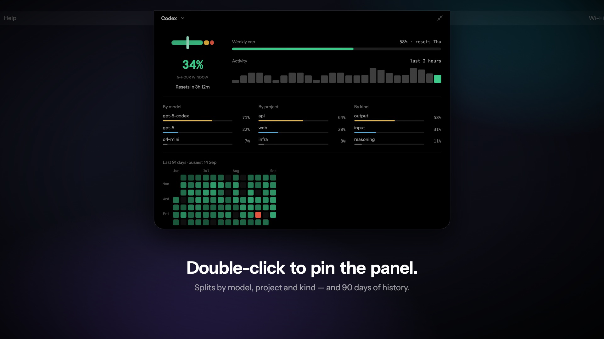

<p align="center">
  
</p>

<h1 align="center">Token Pacer</h1>

<p align="center">
  <strong>Never hit the cap by surprise.</strong><br>
  Claude Code, Codex, Copilot and more — live in your Mac’s notch.
</p>

<p align="center">
  <a href="https://github.com/heybui/token-pacer/releases/latest"></a>
  <a href="https://github.com/heybui/token-pacer/releases"></a>
  
  
  <a href="https://buymeacoffee.com/heybui"></a>
</p>

<p align="center">
  <a href="https://github.com/heybui/token-pacer/releases/latest"><strong>Download for macOS</strong></a> ·
  <a href="https://tokenpacer.com">tokenpacer.com</a> ·
  <a href="https://tokenpacer.com/press">Press kit</a>
</p>

<p align="center">
  <a href="https://tokenpacer.com/press/token-pacer-promo.mp4">
    
  </a>
  <br>
  <sub>▶ <a href="https://tokenpacer.com/press/token-pacer-promo.mp4">Watch the 48-second promo</a></sub>
</p>

---

You find out you were at 94% by being told you’re at 100% — mid-task, on the
afternoon it matters. **Token Pacer keeps every agent’s quota in front of you
all day, so you never have to ask.**

## Why you’ll keep it running

- **Always there, never in the way.** It lives in the notch. No notch? It docks
  in the menu bar, on whichever display you pick.
- **Every agent, side by side.** Claude Code, Codex, Copilot and more on one
  scale, each on its own reset. Click one to pin it to the menu bar.
- **Real numbers only.** Every figure is the provider’s own. When one can’t be
  read, it says so and why — never a guess.
- **Warns you once, then waits.** Set your own amber and red lines per agent.
  Cross one and the pill opens by itself until you look.
- **Nothing to sign into.** No account, no API key, no permission prompts. It
  reads the CLIs you already run and sends nothing but an update check.
- **Light on the Mac it watches.** Native Swift, no web view. The drawing runs on
  CoreAnimation, so it idles cheap and stays cool.

<p align="center">
  
  <br>
  <sub>Double-click the pill to pin the panel — usage by model, project and kind, plus 90 days of history.</sub>
</p>

## Install

**Download** the latest DMG from [Releases](https://github.com/heybui/token-pacer/releases/latest),
or with Homebrew:

```sh
brew install --cask redevify/tap/token-pacer
```

It updates itself from then on. Free, no strings.

## Tell me what breaks

Found a bug or want another agent tracked? [Send feedback](https://tokenpacer.com/#feedback)
or [open an issue](https://github.com/heybui/token-pacer/issues). If Token Pacer
saved you an afternoon, you can [buy me a coffee](https://buymeacoffee.com/heybui) ☕

---

## About this repo

This is the website at [tokenpacer.com](https://tokenpacer.com).

- **App releases live in [token-pacer](https://github.com/heybui/token-pacer/releases).**
  This repo serves the Sparkle appcast at `public/appcast.xml`.
- **The changelog modal reads the latest app release** from the GitHub API and parses
  its body, so editing release notes needs no redeploy.
- **Deploy** is GitHub Pages on every push to `main`. No build-time env.
